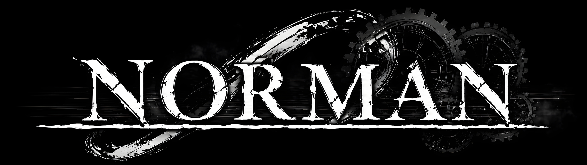

  

## Data Engineering Projects

I'm focused on practical data systems: ingestion, ELT, warehouse modeling, data quality, governance, and observability.

The main project, **NeuroSleep Lakehouse Platform**, processes real sleep neuroscience data through a local lakehouse-style architecture built around reproducible pipelines and governed analytical layers.

**Tools used across the projects:** Python | SQL | PostgreSQL | dbt | Docker | MinIO
